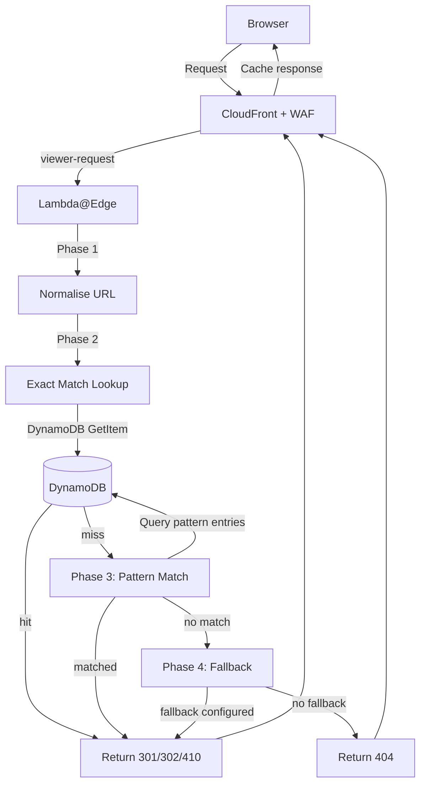
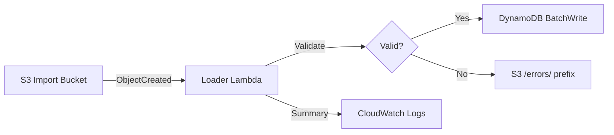
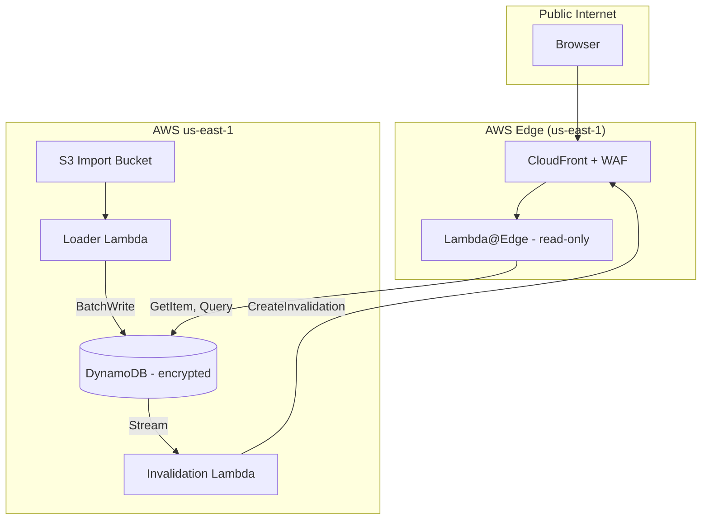

# URL Redirect Service — Design

## Architecture Overview



## Component Design

### 1. CloudFront Distribution

| Property | Value |
|----------|-------|
| Origins | None (Lambda@Edge handles all responses) |
| Aliases | All legacy domains (e.g. `domainA.co.uk`, `domainA.co.nz`) |
| Certificate | Multi-SAN ACM cert in us-east-1 |
| Cache Policy | Custom: cache by Host + URI + query string |
| Cache TTL | 90 days for 301/302, 0 for 404/410 |
| WAF | Attached — rate limiting, CRS, Bot Control |
| Viewer Protocol | Redirect HTTP → HTTPS |

### 2. Lambda@Edge (viewer-request)

**Runtime:** Python 3.12
**Region:** us-east-1 (required for Lambda@Edge)
**Memory:** 128 MB (minimal — just DynamoDB lookups and string operations)
**Timeout:** 5 seconds

#### Phase 1: Normalise

```python
def normalise(uri: str, host: str, querystring: str) -> dict:
    path = uri
    
    # R2: Strip www
    host = re.sub(r'^www\.', '', host)
    
    # R3: Lowercase path
    path = path.lower()
    
    # R5: Collapse double slashes
    path = re.sub(r'//+', '/', path)
    
    # R8: Strip .html suffix
    path = re.sub(r'\.html$', '', path)
    
    # R9: Strip index files
    path = re.sub(r'/(index\.php|index\.html)$', '/', path)
    
    # R4: Strip trailing slash (except root)
    if len(path) > 1 and path.endswith('/'):
        path = path.rstrip('/')
    
    # R7: Drop faceted/sort params
    params = urllib.parse.parse_qs(querystring)
    for p in ['manufacturer', 'limit', 'orderby', 'p', 'product_list_order']:
        params.pop(p, None)
    
    return {'host': host, 'path': path, 'querystring': urllib.parse.urlencode(params, doseq=True)}
```

#### Phase 2: Exact Match

```python
def exact_match(host: str, path: str) -> dict | None:
    result = table.get_item(Key={'pk': f'{host}#{path}'})
    item = result.get('Item')
    
    if not item:
        return None
    
    return {
        'target': item.get('target', ''),
        'statusCode': int(item.get('statusCode', 301)),
        'type': 'exact',
    }
```

#### Phase 3: Pattern Match

```python
def pattern_match(host: str, path: str) -> dict | None:
    # Query all pattern entries for this domain, sorted by priority
    result = table.query(
        KeyConditionExpression=Key('pk').between(
            f'{host}#__pattern__000',
            f'{host}#__pattern__999'
        )
    )
    
    for item in result.get('Items', []):
        regex = re.compile(item['pattern'])
        match = regex.match(path)
        
        if match:
            target = item.get('target', '')
            # Substitute capture groups
            for i, group in enumerate(match.groups(), 1):
                target = target.replace(f'${i}', group or '')
            
            return {
                'target': target,
                'statusCode': int(item.get('statusCode', 301)),
                'fallbackTarget': item.get('fallbackTarget'),
                'type': 'pattern',
            }
    
    return None
```

#### Phase 4: Fallback

```python
def fallback(host: str) -> dict | None:
    result = table.get_item(Key={'pk': f'{host}#__fallback__'})
    item = result.get('Item')
    
    if not item:
        return None
    
    return {
        'target': item['target'],
        'statusCode': int(item.get('statusCode', 301)),
        'type': 'fallback',
    }
```

#### Response Builder

```python
def build_response(entry: dict, original_querystring: str) -> dict:
    if entry['statusCode'] == 410:
        return {
            'status': '410',
            'statusDescription': 'Gone',
            'headers': security_headers(),
            'body': 'This page has been permanently removed.',
        }
    
    location = entry['target']
    if original_querystring:
        separator = '&' if '?' in location else '?'
        location = f'{location}{separator}{original_querystring}'
    
    status = entry['statusCode']
    return {
        'status': str(status),
        'statusDescription': 'Moved Permanently' if status == 301 else 'Found',
        'headers': {
            'location': [{'value': location}],
            **security_headers(),
        },
    }
```

### 3. DynamoDB Table

**Table Name:** `redirects`
**Region:** us-east-1
**Billing:** On-demand (pay-per-request)
**Encryption:** AWS-managed key
**Stream:** Enabled (NEW_AND_OLD_IMAGES)

| Attribute | Type | Role |
|-----------|------|------|
| `pk` | String | Partition key |
| `type` | String | `exact`, `pattern`, or `fallback` |
| `target` | String | Target URL |
| `statusCode` | Number | 301, 302, or 410 |
| `pattern` | String | Regex (pattern entries only) |
| `fallbackTarget` | String | Optional fallback for patterns |
| `createdAt` | String | ISO timestamp |
| `updatedAt` | String | ISO timestamp |
| `source` | String | Origin of entry (e.g. `csv-import`, `manual`) |

**Key design:**
- Exact: `domainA.co.uk#/product/homebiotic-spray`
- Pattern: `domainA.co.uk#__pattern__010`
- Fallback: `domainA.co.uk#__fallback__`

Single-table design — no GSIs needed. Exact match is a single GetItem (1 RCU). Pattern match is a range Query on the partition key prefix.

### 4. CSV Loader Lambda

**Trigger:** S3 ObjectCreated on the import bucket
**Runtime:** Node.js 22.x
**Memory:** 512 MB
**Timeout:** 5 minutes (large CSV files)



**Validation rules:**
1. Path normalisation applied (same rules as Lambda@Edge Phase 1)
2. Target URL reachability: HEAD request, expect 2xx (skip for 410 entries)
3. Loop detection: target host must not match any source domain in the table
4. Duplicate detection: warn if pk already exists (upsert is intentional)

**Batch write:** DynamoDB BatchWriteItem, 25 items per batch, with exponential backoff on throttle.

### 5. Invalidation Lambda

**Trigger:** DynamoDB Stream on the redirects table
**Runtime:** Python 3.12
**Memory:** 128 MB
**Timeout:** 30 seconds

```python
def handler(event, context):
    paths = []
    
    for record in event['Records']:
        if record['eventName'] in ('MODIFY', 'REMOVE'):
            pk = record['dynamodb']['Keys']['pk']['S']
            if '__pattern__' in pk or '__fallback__' in pk:
                # Pattern/fallback changes require full invalidation
                invalidate_all()
                return
            
            # Extract path from pk: "domain#/path" → "/path"
            path = '#'.join(pk.split('#')[1:])
            paths.append(path)
    
    if paths:
        cloudfront.create_invalidation(
            DistributionId=DISTRIBUTION_ID,
            InvalidationBatch={
                'CallerReference': str(int(time.time() * 1000)),
                'Paths': {'Quantity': len(paths), 'Items': paths},
            },
        )
```

### 6. WAF Configuration

| Rule | Type | Action | Threshold |
|------|------|--------|-----------|
| Rate Limit | Rate-based | Block | 1000 req/5min per IP |
| Core Rule Set | AWS Managed | Block | — |
| Bot Control | AWS Managed | Allow verified, block bad | — |
| Geo Restrict | Custom | Optional per-brand | — |

### 7. Monitoring

| Metric | Source | Alarm Threshold |
|--------|--------|-----------------|
| `RedirectMiss` (404s) | CloudFront logs → metric filter | >50 in 5 min |
| `Lambda@Edge Errors` | Lambda metrics | >0 in 1 min |
| `DynamoDB Throttles` | DynamoDB metrics | >0 in 1 min |
| `Invalidation Failures` | Invalidation Lambda errors | >0 in 5 min |

## CDK Construct Interface

```typescript
export interface RedirectBrand {
  /** Legacy domains to redirect from */
  readonly sourceDomains: string[];
  /** Default redirect target for unmatched paths (optional) */
  readonly fallbackUrl?: string;
  /** Path to CSV file for initial import */
  readonly csvPath?: string;
  /** HTTP status code for fallback (default: 301) */
  readonly fallbackStatusCode?: number;
}

export interface RedirectServiceProps {
  /** Brands to configure */
  readonly brands: RedirectBrand[];
  /** CloudFront cache TTL for redirects in seconds (default: 7776000 = 90 days) */
  readonly cacheTtl?: number;
  /** WAF rate limit per IP per 5 minutes (default: 1000) */
  readonly rateLimitPerIp?: number;
  /** SNS topic for alerts (optional) */
  readonly alertTopic?: sns.ITopic;
}

export class RedirectService extends Construct {
  public readonly distribution: cloudfront.Distribution;
  public readonly table: dynamodb.Table;
  public readonly importBucket: s3.Bucket;
  
  constructor(scope: Construct, id: string, props: RedirectServiceProps) { ... }
}
```

## Data Flow Summary

| Flow | Path |
|------|------|
| Redirect request | Browser → CloudFront → Lambda@Edge → DynamoDB → 301/302/410 response |
| Cached redirect | Browser → CloudFront → cached 301 (no Lambda invocation) |
| CSV import | Admin → S3 upload → Loader Lambda → DynamoDB → Stream → Invalidation Lambda → CloudFront |
| Manual edit | Admin → DynamoDB console → Stream → Invalidation Lambda → CloudFront |
| Monitoring | CloudFront logs → S3 → Metric filter → CloudWatch Alarm → SNS |

## Security Boundaries



**IAM Roles:**
- Lambda@Edge: `dynamodb:GetItem`, `dynamodb:Query` on the redirects table only
- Loader Lambda: `dynamodb:BatchWriteItem`, `s3:GetObject` (import bucket), `s3:PutObject` (errors prefix)
- Invalidation Lambda: `dynamodb:DescribeStream`, `dynamodb:GetRecords`, `dynamodb:GetShardIterator`, `cloudfront:CreateInvalidation`

## Deployment Strategy

1. CDK construct in `raindancers-redirector` repository
2. Thin CDK app in BWIP DNS account consumes the construct
3. Single `cdk deploy` creates all resources
4. Brand onboarding = add to `brands` array + `cdk deploy`
5. CSV import happens automatically on first deploy (S3 upload triggers loader)

## Testing Strategy

- **Unit tests:** Normalisation logic, pattern matching, response builder (pure functions, no AWS calls)
- **Integration tests:** DynamoDB local, test full lookup flow end-to-end
- **Load tests:** Confirm DynamoDB on-demand handles burst traffic without throttling
- **Acceptance tests:** Crawl all legacy URLs from CSV, verify single-hop 301 to live 200
