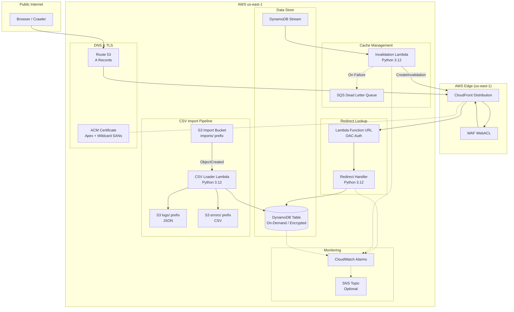
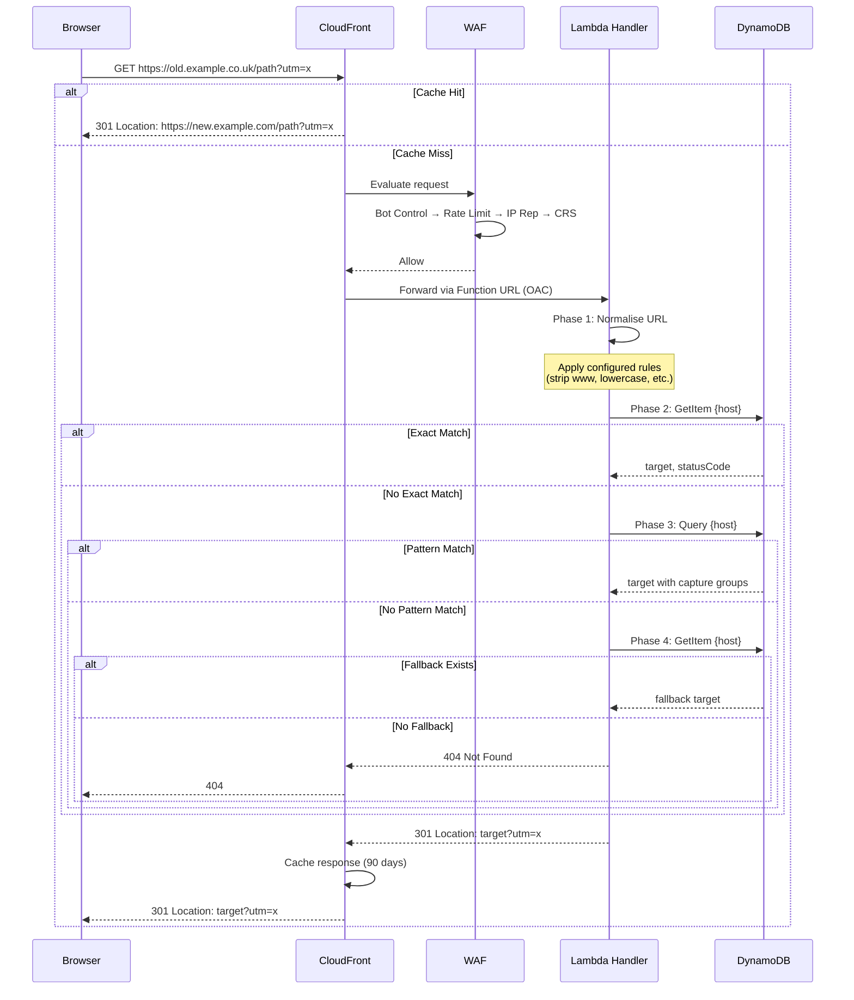
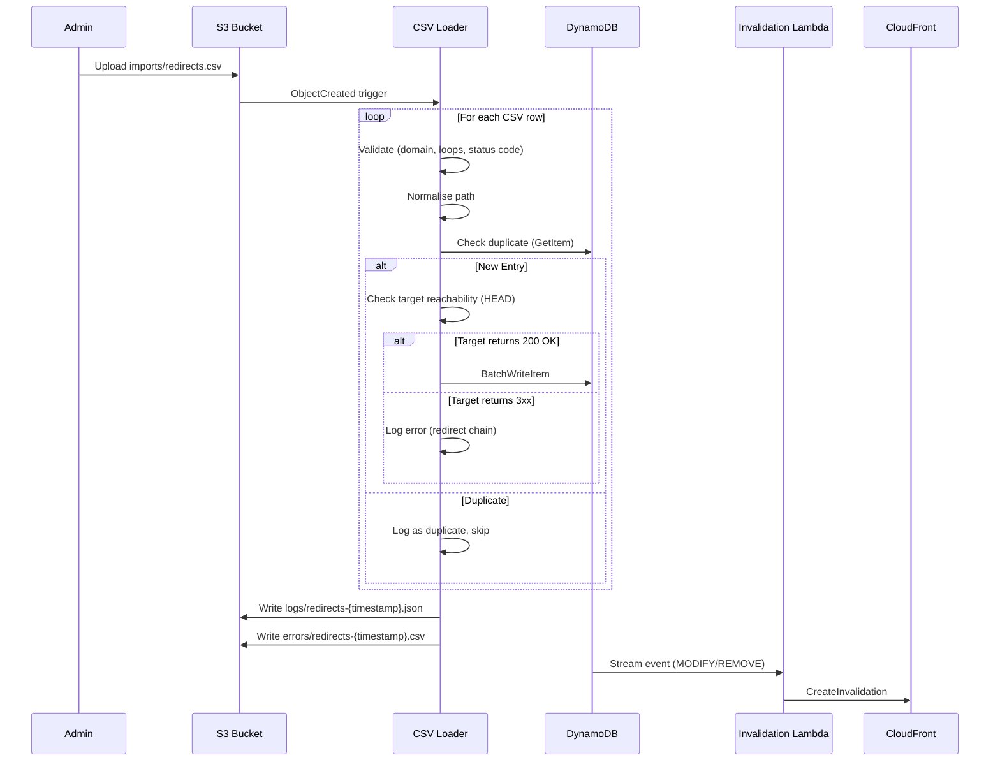
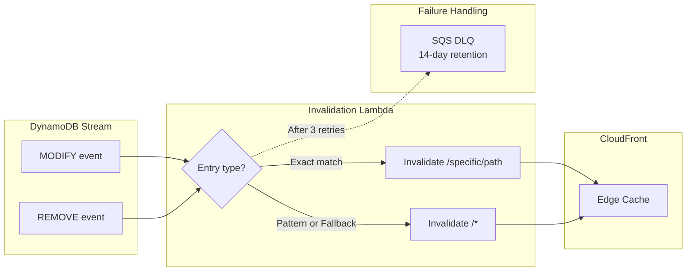

# raindancers-redirector

A reusable AWS CDK construct for multi-domain URL redirect services. Deploys a complete redirect infrastructure using CloudFront, Lambda, and DynamoDB — no servers to manage, no code changes to add redirects.

## Use Case

Redirect legacy domains (e.g. `domainA.co.uk`, `domainA.co.nz`) to new consolidated domains (e.g. `domainA.com/uk`) while preserving SEO link equity, bookmarks, and inbound links.

## Architecture

### Infrastructure Components



### Redirect Request Flow



### CSV Import Flow



### Cache Invalidation Flow



## Installation

```bash
npm install raindancers-redirector
```

## Usage

```typescript
import { RedirectService, NormalisationRule } from 'raindancers-redirector';

new RedirectService(this, 'Redirects', {
  sourceDomains: [
    { domain: 'domainA.co.uk', fallbackUrl: 'https://domainA.com/uk' },
    { domain: 'domainA.co.nz', fallbackUrl: 'https://domainA.com/nz' },
    { domain: 'domainB.com.au' },
  ],
  normalisationRules: [
    { rule: NormalisationRule.STRIP_WWW },
    { rule: NormalisationRule.LOWERCASE_PATH },
    { rule: NormalisationRule.COLLAPSE_SLASHES },
    { rule: NormalisationRule.STRIP_HTML_EXTENSION },
    { rule: NormalisationRule.STRIP_INDEX_FILES },
    { rule: NormalisationRule.STRIP_TRAILING_SLASH },
    { rule: NormalisationRule.DROP_FACETED_PARAMS, params: ['manufacturer', 'limit', 'orderby', 'p', 'product_list_order'] },
    { rule: NormalisationRule.DROP_TRACKING_PARAMS, params: ['utm_source', 'utm_medium', 'utm_campaign', 'utm_term', 'utm_content', 'fbclid', 'gclid', 'msclkid', 'dclid'] },
  ],
  enforceNoRedirectChains: true,
  rateLimitPerIp: 1000,
  alertTopic: mySnsTopic,
});
```

## Requirements

- Stack must be deployed to **us-east-1** (CloudFront requirement)
- Route 53 hosted zones for each source domain must exist in the same account
- AWS SSO login must be active before deployment

## Props

| Prop | Type | Required | Default | Description |
|------|------|----------|---------|-------------|
| `sourceDomains` | `SourceDomain[]` | Yes | — | Legacy domains to redirect from |
| `normalisationRules` | `NormalisationRuleConfig[]` | No | `[]` (none) | URL normalisation rules to apply before lookup |
| `enforceNoRedirectChains` | `boolean` | No | `true` | Reject CSV entries where target returns 3xx instead of 200 |
| `cacheTtl` | `number` | No | `7776000` (90 days) | CloudFront cache TTL in seconds |
| `rateLimitPerIp` | `number` | No | `100` | WAF rate limit per IP per 5 minutes (does not apply to verified crawlers) |
| `alertTopic` | `sns.ITopic` | No | — | SNS topic for CloudWatch alarm notifications |
| `encryptionKey` | `kms.IKey` | No | — (SSE-S3) | KMS key for S3 bucket encryption. When omitted, uses S3-managed encryption (SSE-S3). Use when compliance requires customer-managed keys. |

### SourceDomain

| Prop | Type | Required | Description |
|------|------|----------|-------------|
| `domain` | `string` | Yes | The legacy domain to redirect from |
| `fallbackUrl` | `string` | No | Default redirect for unmatched paths on this domain |

### NormalisationRuleConfig

| Prop | Type | Required | Description |
|------|------|----------|-------------|
| `rule` | `NormalisationRule` | Yes | The normalisation rule to apply |
| `params` | `string[]` | No | Query params to drop. Required for `DROP_FACETED_PARAMS` and `DROP_TRACKING_PARAMS`. |

## Resources Created

| Resource | Purpose |
|----------|---------|
| DynamoDB Table | Redirect rule storage (on-demand, encrypted, PITR) |
| Lambda Function + URL | Redirect handler (Python 3.12, 128MB) |
| CloudFront Distribution | Edge caching + TLS termination |
| ACM Certificate | TLS for all source domains (apex + wildcard) |
| WAF WebACL | Bot Control, rate limiting, IP reputation, Known Bad Inputs, Core Rule Set |
| S3 Bucket | CSV upload target for bulk imports |
| Lambda Function | CSV loader (Python 3.12, 512MB) |
| Lambda Function | Cache invalidation on rule changes (Python 3.12) |
| CloudWatch Alarms | Lambda errors, DynamoDB throttles |
| Route 53 Records | A records (apex + wildcard) → CloudFront |

## CSV Import Format

Upload a CSV to the `imports/` prefix in the import bucket to bulk-load redirects:

```
s3://{bucket}/imports/my-redirects.csv
```

```csv
source_domain,source_path,target_url,status_code
domainA.co.uk,/old-product,https://domainA.com/uk/new-product,301
domainA.co.uk,/removed-page,,410
domainA.co.nz,/blog/old-post,https://domainA.com/nz/blog/new-post,301
```

CSVs can contain redirects for any configured source domain — there is no per-domain file requirement.

Only files uploaded to `imports/*.csv` trigger processing. Logs and errors are written to separate prefixes and do not trigger reprocessing.

### Validation

The loader validates each row:
- `source_domain` must be one of the configured `sourceDomains`
- Target URL must be reachable (HEAD request)
- No redirect loops (target host cannot match source domain)
- When `enforceNoRedirectChains` is true, target must return 200 OK (not 3xx)
- Duplicate entries (already in DynamoDB) are skipped
- Normalisation rules (if configured) are applied to paths before writing

### Output Files

Each CSV import produces output files in the same S3 bucket:

| Path | Format | Content |
|------|--------|---------|
| `logs/{filename}-{timestamp}.json` | JSON | Full processing log with summary and per-row outcomes |
| `errors/{filename}-{timestamp}.csv` | CSV | Error rows only (for quick review) |

### Log File Structure (JSON)

```json
{
  "source_file": "imports/my-redirects.csv",
  "processed_at": "2026-07-03T12:00:00Z",
  "summary": {
    "total": 150,
    "success": 140,
    "duplicate": 5,
    "error": 5
  },
  "entries": [
    {
      "row_number": 2,
      "source_domain": "domainA.co.uk",
      "source_path": "/old-path",
      "target_url": "https://domainA.com/uk/new-path",
      "status_code": "301",
      "outcome": "success",
      "detail": "Written to DynamoDB as pk: domainA.co.uk#/old-path",
      "target_response_headers": "content-type: text/html | server: nginx",
      "processed_at": "2026-07-03T12:00:01Z"
    }
  ]
}
```

## URL Normalisation

Normalisation is **opt-in**. By default, no normalisation is applied. Enable specific rules via the `normalisationRules` prop.

### Available Rules

| Rule | Effect |
|------|--------|
| `STRIP_WWW` | Remove `www.` prefix from host |
| `LOWERCASE_PATH` | Lowercase the entire path |
| `COLLAPSE_SLASHES` | Replace `//` with `/` in path |
| `STRIP_INDEX_FILES` | Remove `/index.php` and `/index.html` from path |
| `STRIP_HTML_EXTENSION` | Remove `.html` suffix from path |
| `STRIP_TRAILING_SLASH` | Remove trailing `/` (except root) |
| `DROP_FACETED_PARAMS` | Drop query params specified in the rule's `params` field |
| `DROP_TRACKING_PARAMS` | Drop tracking params specified in the rule's `params` field |

When normalisation changes the URL, the redirect handler returns a single 301 to the normalised form before performing the redirect lookup. This avoids redirect chains — normalisation and redirect happen in one hop.

### Query Param Handling

- **`DROP_FACETED_PARAMS`** — drops the params specified in the rule's `params` field.
- **`DROP_TRACKING_PARAMS`** — drops the params specified in the rule's `params` field. By default tracking params are preserved (passed through to the redirect target).
- Both rules require `params` to be provided — the construct validates this at synth time.
- If neither rule is enabled, all query params are passed through unchanged.

## Robots.txt

This service intentionally does not serve a `robots.txt` file. For a redirect service, you *want* crawlers to hit the legacy URLs, receive the 301 responses, and follow them to the new domain. This is how search engines discover the new URLs and transfer link equity. Blocking crawlers with `robots.txt` would slow down re-indexing and harm SEO during domain migration.

The WAF Bot Control rule allows verified crawlers (Googlebot, Bingbot, etc.) through without rate limiting.

## WAF Rule Order

The WAF WebACL uses a deliberate rule evaluation order to protect against abuse while ensuring legitimate search engine crawlers are never blocked.

| Priority | Rule | Action | Purpose |
|----------|------|--------|---------|
| 1 | Bot Control (COMMON) | Varies | Labels verified crawlers (Googlebot, Bingbot) before rate limiting runs |
| 2 | Rate Limit (100/5min) | Block | Blocks abusive IPs — excludes verified bots via scope-down statement |
| 3 | IP Reputation List | Block | Blocks known-malicious IPs (Amazon threat intelligence) |
| 4 | Known Bad Inputs | Block | Blocks exploit patterns (Log4j, Java deserialization) |
| 5 | Core Rule Set | Block | Broad protection (SQLi, XSS, path traversal) |

### Why Bot Control runs first

The rate-based rule must NOT apply to legitimate crawlers like Googlebot and Bingbot. During domain migration, crawlers aggressively re-index legacy URLs to discover the new targets — this is the primary purpose of the redirect service.

AWS WAF evaluates rules in priority order. Bot Control must run first so it can label verified crawlers with `awswaf:managed:aws:bot-control:bot:verified`. The rate limit rule then uses a scope-down statement with a NOT condition on this label, meaning it only applies to requests that are NOT from verified bots.

Without this ordering, crawlers would hit the rate limit during aggressive re-indexing and be blocked — defeating the purpose of the entire service.

### Cost note

Bot Control has per-request charges, but is placed first because the alternative (rate-limiting verified crawlers) is functionally broken for a redirect service. After CloudFront cache warm-up, actual request volume reaching WAF is low since most responses are served from cache.

## Known Limitations

- **Regex complexity**: Pattern-match entries use Python `re.compile()` on patterns stored in DynamoDB. No regex complexity validation is performed. Malicious or poorly-written patterns (catastrophic backtracking / ReDoS) could cause Lambda timeouts. The 5-second Lambda timeout is the mitigation. Test regex patterns for performance before adding to DynamoDB.

## DynamoDB Key Design

| Entry Type | Key Format | Example |
|------------|-----------|---------|
| Exact match | `{domain}#{path}` | `domainA.co.uk#/old-product` |
| Pattern | `{domain}#__pattern__{priority}` | `domainA.co.uk#__pattern__010` |
| Fallback | `{domain}#__fallback__` | `domainA.co.uk#__fallback__` |

## Sub-Constructs

The construct is composed of smaller, independently usable constructs:

| Construct | File | Purpose |
|-----------|------|---------|
| `RedirectsTable` | `redirects-table.ts` | DynamoDB table |
| `RedirectHandler` | `redirect-handler.ts` | Lambda + Function URL |
| `RedirectDistribution` | `redirect-distribution.ts` | CloudFront + ACM + Route53 |
| `RedirectWaf` | `redirect-waf.ts` | WAF WebACL |
| `CsvImport` | `csv-import.ts` | S3 bucket + CSV loader |
| `Invalidation` | `invalidation.ts` | Stream-triggered cache invalidation |
| `FallbackSeeder` | `fallback-seeder.ts` | Seeds DynamoDB fallback entries at deploy time |
| `Monitoring` | `monitoring.ts` | CloudWatch alarms |

## Development

```bash
# Build
npx projen build

# Run TypeScript CDK tests
npx projen test

# Run Python Lambda unit tests
pytest test/lambda/
```

See [.devcontainer/README.md](.devcontainer/README.md) for development environment setup.

## License

Apache-2.0
